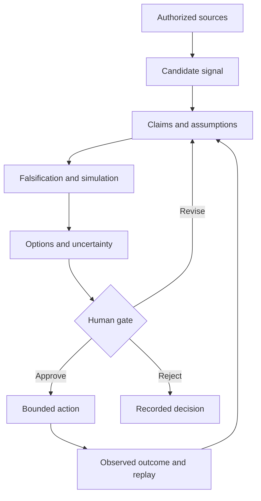

# Evidence-Guided Engineering Agents

> Governed AI personas that turn authorized enterprise evidence into falsifiable engineering, BOM, IP, legal, funding, and delivery recommendations.

**Status:** exploratory reference architecture and working-group proposal. It is not a production system, legal opinion, patentability assessment, or autonomous decision authority.

## Why this repository exists

Engineering organizations already have fragments of the evidence needed for better decisions: requirements, architecture decisions, bills of materials, test results, operational telemetry, incident reviews, technical discussions, and market observations. These fragments are distributed and often lose their assumptions, uncertainty, and decision history.

This repository explores a governed board of AI personas that can:

1. inspect explicitly authorized evidence;
2. detect a candidate problem, opportunity, contradiction, or reusable pattern;
3. state claims and assumptions separately;
4. search for evidence that could falsify the proposal;
5. expose uncertainty and competing objectives;
6. recommend a reversible next action;
7. request human approval before consequential action;
8. learn from the outcome without rewriting history.

## Initial personas

| Domain | Persona family | Typical contribution |
|---|---|---|
| BOM and delivery | BOM Intelligence | MTP-to-BOM reasoning, sizing, Data/ML/SBOM coherence, telemetry feedback, reviewed IaC generation |
| Integration | Integration Strategy Challenger | Integration options, dependencies, failure modes, test and observability obligations |
| IP and legal | IP & Legal Opportunity | Invention capture, prior-art challenge, protection options, legal/regulatory risks and opportunities |
| Funding and economics | Funding & Business Evidence | Funding discovery, probabilistic business cases, assumption stress tests, staged investment |

These are roles in a decision process, not artificial executives. They may retrieve, compare, calculate, simulate, draft, and challenge. Humans retain accountability and authority.

## Repository map

- [`docs/vision.md`](docs/vision.md) — scope, principles, and non-goals.
- [`docs/extended-agent-board.md`](docs/extended-agent-board.md) — persona board and collaboration model.
- [`docs/working-group-proposal.md`](docs/working-group-proposal.md) — bounded pilot proposal.
- [`governance/`](governance/) — agent contract, evidence model, authorization, and decision gates.
- [`personas/`](personas/) — domain persona specifications.
- [`shared/schemas/`](shared/schemas/) — machine-readable evidence, opportunity, and decision records.
- [`experiments/`](experiments/) — synthetic, falsifiable demonstration plans.
- [`vendor-landscape/`](vendor-landscape/) — build/buy/integrate assessment method.

## Common decision chain

$$
\text{source} \rightarrow \text{signal} \rightarrow \text{claim} \rightarrow
\text{challenge} \rightarrow \text{evidence} \rightarrow \text{uncertainty} \rightarrow
\text{human decision} \rightarrow \text{outcome/replay}
$$

## Safety and confidentiality

Do not place confidential inventions, personal data, customer data, credentials, private conversations, or restricted source code in this public repository. See [`SECURITY.md`](SECURITY.md) and [`governance/data-authorization.md`](governance/data-authorization.md).

## Current phase

The first milestone is not a large autonomous platform. It is a small, replayable experiment comparing a governed agent-assisted workflow with an existing human workflow on synthetic or already-public cases.
