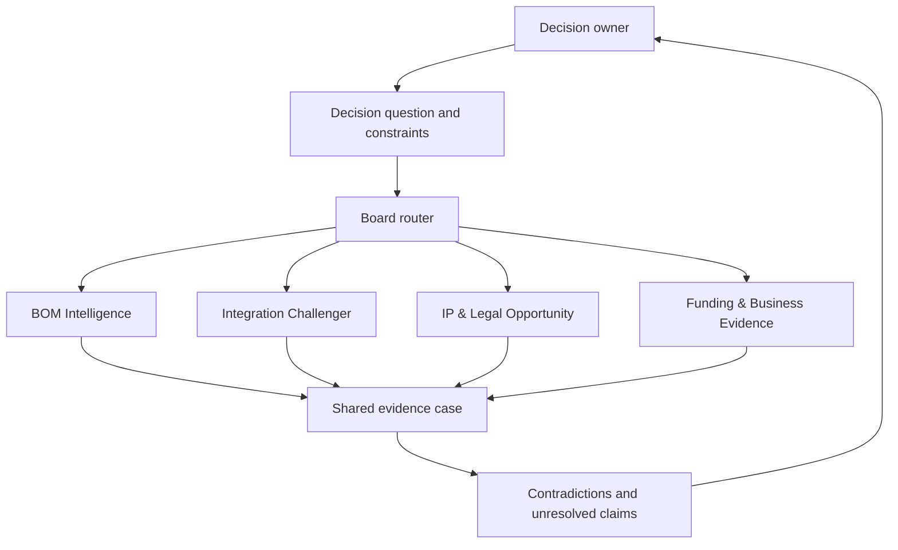

# Extended agent board

## Operating model

The board is a temporary composition of specialist roles around a decision. It should not instantiate every persona for every question.

## Role contract

Every persona must declare:

- question it is answering;
- sources it was authorized to use;
- facts observed and their provenance;
- interpretations and assumptions;
- alternatives considered;
- counterevidence sought and found;
- uncertainty and missing evidence;
- recommended next action and invalidation trigger;
- actions it is forbidden to take.

## Routing examples

| Decision | Minimum useful personas | Usually unnecessary initially |
|---|---|---|
| Size a deployment platform | BOM Intelligence, Integration Challenger | IP persona unless a novel mechanism emerges |
| Protect a technical invention | IP Scout, Prior-Art Challenger, Business Evidence | IaC generator |
| Fund a reusable internal capability | Business Evidence, Integration Challenger | Patent drafting unless protection is plausible |
| Generate IaC from an approved BOM | BOM Intelligence, Security/Platform review | Market analyst |

## Disagreement is an output

The board must preserve disagreements rather than forcing artificial consensus. A decision package can contain:

- supported claims;
- contradicted claims;
- unresolved claims;
- differing interpretations of the same evidence;
- evidence gaps and their decision impact;
- conditions under which a recommendation expires.

