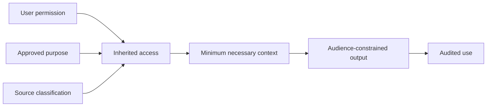

# Data authorization and purpose limitation

## Source admission test

A source may be used only when all answers are documented:

1. Who owns or controls the source?
2. For what purpose was it originally collected?
3. Is the proposed agent purpose compatible and approved?
4. Which identities, projects, and time ranges are in scope?
5. Which fields or passages are actually necessary?
6. May derived embeddings, summaries, or indexes be retained?
7. Where may processing occur?
8. Who may see the output?
9. When must source copies and derived data be deleted?
10. Which human authority approved the configuration?

## Permission model

The effective permission is the intersection of user rights, source policy, approved purpose, and output audience. Connectors must preserve source-level access controls.

## External transmission

Before sending a dossier to a supplier, partner, legal adviser, patent professional, funding body, or other external party, the system must display:

- exact recipient and organization;
- selected files and extracted fields;
- purpose and legal/contractual basis;
- confidentiality classification;
- unresolved ownership or contribution questions;
- human approver and decision timestamp.

