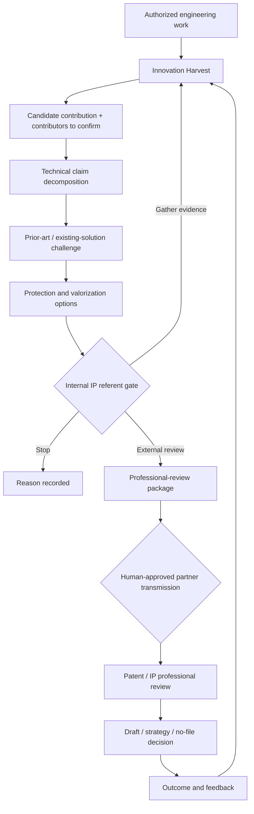

# Innovation-to-IP Protection — exploratory initiative

**Status:** working hypothesis / discussion draft. This initiative is intentionally not frozen. It is expected to evolve with inventor, internal IP referent, patent-professional, legal, security, and business feedback.

## Purpose

Explore whether governed AI assistance can move IP awareness earlier into engineering work without pretending to replace inventors, internal IP governance, patent attorneys, legal counsel, or formal patentability / freedom-to-operate opinions.

The central hypothesis is that useful inventions are often not discovered as isolated "eureka" moments. They may emerge from an original integration, an unexpected technical effect, a new combination of known mechanisms, a constraint-driven adaptation, or a solution developed before competitors. A governed assistant may help surface these signals while the technical context is still available.

## Candidate business-engineering flow

## Persona composition

The initiative deliberately composes narrow roles instead of one artificial "patent lawyer":

1. **Innovation Harvester** — surfaces candidate problem-solution pairs, technical effects, unusual combinations, reusable mechanisms, and potentially protectable or strategically valuable contributions from explicitly authorized sources.
2. **Prior-Art Challenger** — searches evidence that could defeat or weaken novelty and records feature-level mappings, not just semantic similarity.
3. **Patentability Preparation Adviser** — prepares a non-legal preliminary dossier and unresolved questions for an internal IP referent or patent professional. It never declares an invention patentable.
4. **Protection Strategy Explorer** — exposes candidate routes such as patent, trade secret, defensive publication, design right, copyright, dated evidence, licensing, or no protection, for professional review.
5. **Partner Routing Assistant** — after a human decides external review is appropriate, recommends suitable approved partners based on declared capabilities, jurisdiction, technical domain, conflicts/availability where known, commercial constraints, and verified service feedback. It cannot transmit confidential material without explicit approval.

These can remain separate personas or be implemented as modes of the existing `IP & Legal Opportunity` family. The experiment should determine whether separation materially improves quality, auditability, or reviewer workload.

## Source tiers

Every retrieval must carry source provenance and authorization status.

| Tier | Examples | Default use |
|---|---|---|
| S0 — internal authorized | design notes, ADRs, test evidence, experiment reports, approved discussions, invention disclosures | harvest candidates only within explicit scope |
| S1 — public patent | EPO/Espacenet, WIPO/PATENTSCOPE, national patent-office public data, other legally accessible patent sources | prior-art challenge |
| S2 — public non-patent | standards, papers, product documentation, public repositories, conference material, web sources | prior-art / existing-solution challenge |
| S3 — licensed/private databases | commercial patent/search platforms, licensed scientific or market databases | only under valid subscription, access rights, and terms |
| S4 — restricted external | customer, partner, NDA or privileged material | prohibited by default; requires explicit purpose-bound authorization |

The agent must not bypass paywalls, authentication, robots restrictions, contractual limits, confidentiality obligations, or database licensing terms.

## Practitioner-mentioned tools and market references

The tools below are retained as **reference points for build/buy/integrate comparison**, not as endorsements and not as validated benchmarks. The list originates from practitioner discussion and should evolve as hands-on evaluation evidence is collected.

| Tool | Current positioning worth examining | Official reference |
|---|---|---|
| **Tradespace** | enterprise-side invention harvesting, invention disclosure development, IP workflow and access to external patent professionals; particularly relevant to the upstream `Innovation Harvester → professional review` hypothesis | https://tradespace.io/ ; https://tradespace.io/platform/create/ |
| **Questel Orbit Intelligence** | established patent intelligence/search and analytics platform, now including AI-assisted capabilities; useful comparator for prior-art search, portfolio intelligence and incumbent-suite integration | https://www.questel.com/patent/ip-intelligence-software/orbit-intelligence/ |
| **IPRally** | AI-native patent search/review/classification with novelty, patentability, invalidity and FTO search use cases; useful comparator for the `Prior-Art Challenger` | https://www.iprally.com/product/overview ; https://www.iprally.com/solutions/patent-searcher |
| **DeepIP** | AI-assisted patentability, prior-art search, disclosure preparation, drafting and prosecution; useful comparator across the transition from preliminary invention analysis to patent-professional work | https://www.deepip.ai/ ; https://www.deepip.ai/products/ai-patentability |
| **Ankar** | AI platform spanning idea generation, patentability assessment, drafting, prosecution and protection workflows; useful comparator for end-to-end innovation/IP orchestration | https://ankar.ai/ ; https://ankar.ai/product-pages/overview |
| **Qthena (Questel / ipQuants)** | AI-assisted IP workspace covering invention disclosures, patent-search review, FTO, drafting, claim charts and office-action responses; useful comparator for law-firm/professional downstream workflows | https://www.questel.com/qthena/ ; https://www.questel.com/qthena/features/ask-qthena |

### Practitioner context to preserve

The current qualitative feedback distinguishes two broad market patterns:

- established IP-suite vendors extending historical products with AI, potentially offering breadth and workflow integration but not necessarily the best task-level ergonomics or performance;
- newer AI-native specialists targeting narrower workflows, potentially more agile or effective on the task for which they were designed.

This is **an observation to test**, not a conclusion. Vendor claims, practitioner experience, controlled benchmark results, security/confidentiality review, licensing constraints, interoperability, and total cost should remain separate evidence classes.

The practitioner feedback also distinguishes enterprise/in-house workflows from law-firm/prosecution workflows. That distinction should be preserved in future vendor evaluation rather than comparing all products under one generic "patent AI" score.

## Proposed decision gates

| Gate | Decision | Minimum evidence | Human authority |
|---|---|---|---|
| I0 | May this corpus be harvested? | scope, owner, confidentiality, retention, allowed purposes | source/data owner |
| I1 | Is there a candidate worth exploring? | problem, proposed contribution, technical effect, supporting artifact refs | inventor / engineering referent |
| I2 | Is the technical claim decomposition credible? | claim elements, assumptions, contributors to confirm, unresolved questions | inventor / domain expert |
| I3 | Has the candidate been seriously challenged? | search strategy, source coverage, closest references, feature mappings, negative evidence | internal IP referent or delegated reviewer |
| I4 | Is external professional review proportionate? | preliminary dossier, uncertainties, protection options, business relevance | authorized IP owner / referent |
| I5 | May this exact package leave the company? | recipient, files/fields, confidentiality class, purpose, conflicts/contract status | authorized human |
| I6 | What professional action follows? | professional analysis | patent attorney / qualified professional / accountable legal authority |
| I7 | What may be learned from the outcome? | outcome, reviewer feedback, permitted reusable signals | governance owner |

No AI output can approve I5 or I6.

## Professional-review package

A useful pre-draft should be evidence-first rather than a synthetic legal opinion. It may contain:

- concise invention/problem context;
- candidate technical contribution and measurable effect;
- chronology and public-disclosure questions;
- contributors/inventors **to confirm**, never inferred as fact;
- claim-like technical decomposition clearly labelled as exploratory;
- prior-art search strategy and databases queried;
- closest patent and non-patent references with feature mappings;
- evidence for and against novelty / non-obviousness hypotheses;
- integration/combinatorial originality hypothesis where relevant;
- known products or solutions that may overlap;
- unresolved questions for the inventors;
- protection / publication / secrecy options for professional review;
- source manifest, timestamps, tool/model versions, confidence and search limits.

It must explicitly separate **novelty search**, **patentability**, **freedom to operate**, **ownership/inventorship**, **validity**, **enforceability**, and **business value**. A positive signal in one category is not evidence of another.

## Suggestion without synthetic invention

The assistant may propose exploration prompts such as:

- which constraint forced this architecture to differ from known solutions?
- what combination of existing mechanisms produced a new technical effect?
- what would a competitor have to copy to reproduce the effect?
- which alternative implementation would preserve the effect?
- what evidence would show that the idea is already known?

It must not fabricate experimental results, contributors, dates, novelty, or legal conclusions. Suggestions remain hypotheses until engineers produce evidence.

## Partner marketplace hypothesis

A future partner marketplace is an optional extension, not a prerequisite. Recommendation should optimize **fit for the requested review**, not create a simplistic universal score for patent professionals.

Candidate factors may include technical domain, jurisdiction, requested service, language, declared availability, conflict status, pricing model, response time, and verified customer feedback. Professional outcome quality is difficult to reduce to a single score and must not be inferred from grant rate alone.

All routing remains human-approved and uses an allow-listed partner set under appropriate contractual and confidentiality controls.

## Experiment / falsification plan

Compare the current human workflow with the governed-assisted workflow on synthetic, public, or already-cleared historical cases.

Measure at least:

- candidate recall and reviewer-confirmed precision;
- useful prior-art references found;
- unsupported or misleading references;
- reviewer time to understand the case;
- number and quality of missing questions surfaced;
- source-traceability completeness;
- false-positive burden on engineers and IP reviewers;
- information leakage / authorization violations (target = zero);
- whether the professional reviewer considers the package materially more useful than the baseline disclosure.

Where possible, blind the reviewer to package origin.

## Removal test

Remove or merge any role that does not materially improve candidate discovery, challenge quality, dossier completeness, traceability, or reviewer time relative to the existing workflow. Do not retain an AI role merely because it can generate polished text.

## Open questions

- Which internal engineering sources may be harvested, and on what opt-in/opt-out basis?
- What should trigger a candidate without creating notification fatigue?
- Which public and licensed databases provide sufficient recall for each technical domain?
- How should search coverage and "not found" uncertainty be represented?
- Should invention harvesting run continuously, at milestones, or only on explicit request?
- Where is the boundary between useful technical suggestion and unsafe contamination of inventorship evidence?
- What minimum package would an external patent professional actually prefer to receive?
- Which marketplace/recommendation signals are legitimate and auditable?

The answers are deliberately left open pending practitioner feedback.