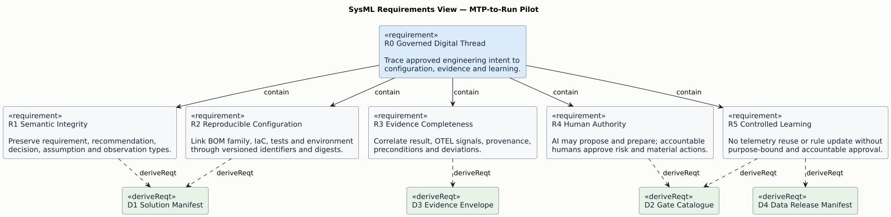
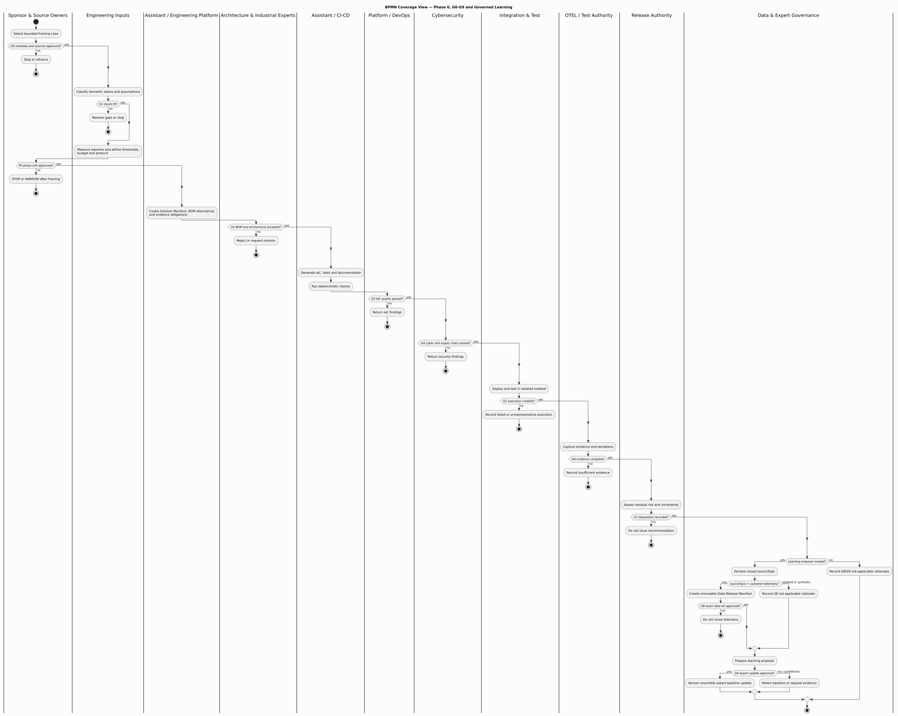
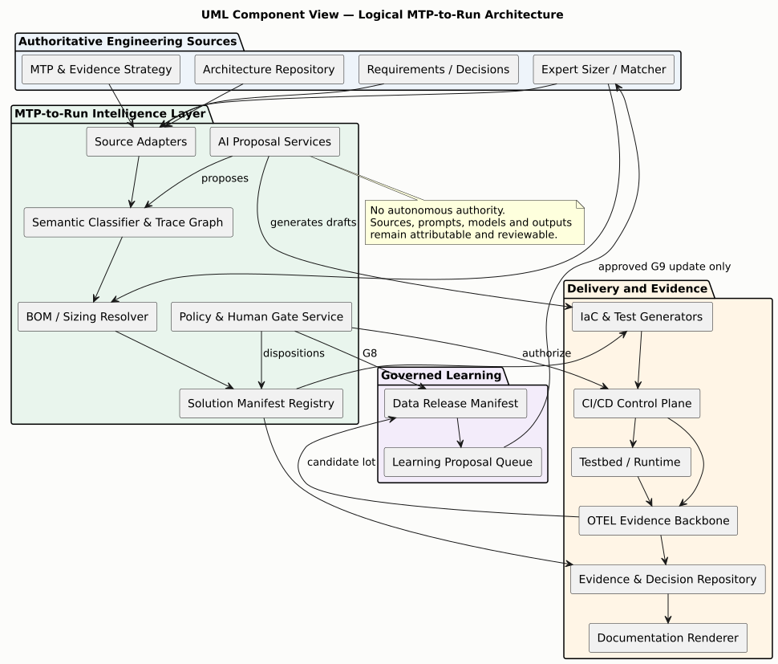
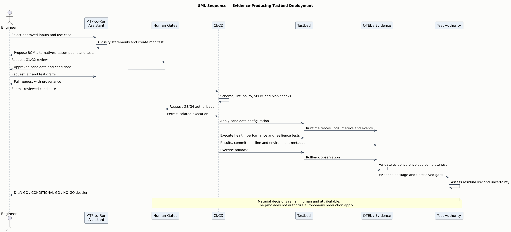
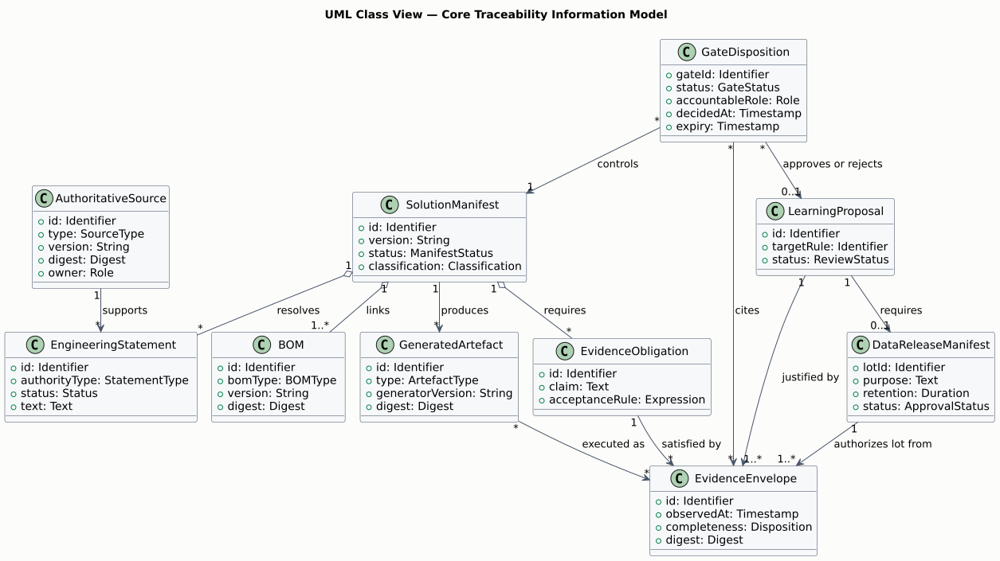

# MTP-to-Run

## Evidence-Guided Industrialization and AI-Augmented CI/CD

**Proposal for a bounded working group and a 90-day pilot**

| Field | Value |
|---|---|
| Status | Discussion draft / working initiative |
| Proposed sponsor | Technical Authority Director — to be confirmed |
| Proposed initiative lead | To be confirmed |
| Requested first decision | Authorize a two-week framing phase |
| Initial horizon | 90-day pilot, followed by an evidence-based stop/continue decision |
| Initial operational boundary | Design and testbed; no autonomous production change |
| Classification | Public synthetic review material; no enterprise or customer data |
| Version | 0.1.0 |
| Date | 9 August 2026 |

> This is not an official announcement, a target architecture decision or a procurement request. It is a review candidate intended to establish whether a narrow, evidence-producing pilot is justified.

---

## 1. Executive proposal

The proposal is to create a small, time-bounded working group to test whether the organization can safely connect five capabilities that currently tend to remain separated:

1. recommendations and evidence expectations expressed by the Master Test Plan (MTP);
2. industrial sizing knowledge and approved component catalogues;
3. BOM, SBOM, Data-BOM and ML-BOM configuration control;
4. governed generation and execution of Infrastructure as Code (IaC);
5. evidence capture, release decision support and approved operational learning.

The intended chain is:

> **MTP recommendations → explicit constraints and hypotheses → traceable BOM variants → governed IaC and tests → testbed evidence → human release recommendation → approved learning proposal.**

The value hypothesis is not that an AI should deploy infrastructure by itself. The value hypothesis is that a controlled assistant can reduce transcription losses, decision latency, undocumented assumptions and false assurance while preserving accountable human decisions.

The pilot would reuse existing assets before introducing new products: MTP material, architecture and product constraints, expert sizing workbooks, approved component information, CI/CD components, observability, test evidence repositories and existing governance. Commercial products would be considered only where they cover a mature commodity capability better than an internal implementation.

### 1.1 Decision requested from the sponsor

Authorize a **two-week framing phase**, with no purchase and no production change, to produce:

- the confirmed pilot use case and owner;
- an inventory of reusable assets and authoritative sources;
- a minimal information model and traceability contract;
- a security, confidentiality and data-reuse assessment;
- the final 90-day pilot plan, effort range and stop conditions;
- a recommendation to proceed, narrow or stop.

### 1.2 Why a dedicated initiative directory

A dedicated initiative directory is proposed because the work crosses MTP, architecture, BOMs, IaC, CI/CD, observability and governance. It should remain distinct from any product repository and must not be confused with the authoritative source of an existing artefact.

The directory contains specifications, examples, validation rules and synthetic pilot material. A controlled implementation may later link to authoritative systems rather than copy their truth. This follows the rule:

> **No duplication of truth: reference, transform and attest; do not silently fork authoritative sources.**

---

## 2. Context and continuity

### 2.1 Existing direction

The proposal extends, rather than replaces, the existing direction of AI-Augmented Test Authority and STRAT-Q:

`Claim → Assumption → Risk → Model → Evidence → Decision → Learning`

The current direction is to transform fragmented evidence into release recommendations that are calibrated, reproducible and auditable. AI may support retrieval, comparison, inconsistency detection, prioritization and drafting. Accountable humans arbitrate disagreement, accept residual risk and sign the final decision.

The MTP-to-Run proposal adds a controlled path from recommended evidence and deployment constraints to executable configuration and back to observed evidence.

### 2.2 Why the MTP matters upstream

The MTP should not be treated only as a document consumed after architecture and deployment choices have already been fixed. It can contain information that materially influences the solution configuration:

- priority failure modes and risk exposures;
- expected nominal, peak, endurance and degraded workloads;
- environment representativity requirements;
- resilience, recovery and continuity scenarios;
- required test data and constraints;
- required observability signals and evidence;
- entry, exit and release decision criteria;
- assumptions that remain to be demonstrated.

However, an MTP recommendation is not automatically a contractual requirement or architecture decision. The proposed system must preserve the nature, authority and approval status of every input.

### 2.3 Opportunity created by AI-augmented CI/CD

The proposal offers a concrete, bounded interpretation of an AI-augmented CI/CD leadership mandate:

- augment analysis and preparation before execution;
- generate code and evidence artefacts under policy;
- challenge missing or inconsistent information;
- keep deterministic validation and human gates around material actions;
- learn from evidence through reviewed proposals, not silent model updates.

The goal is to reduce decision latency and false assurance, not to maximize generated code or test volume.

---

## 3. Problem statement

Industrial delivery knowledge is often distributed across documents, spreadsheets, expert experience, architecture repositories, test plans, CI/CD definitions, installation records and operational telemetry. Each translation introduces risks:

- a recommendation is omitted when converted into a BOM;
- a sizing assumption becomes an undocumented fact;
- a BOM and deployed configuration diverge;
- generated IaC is syntactically valid but operationally unsuitable;
- installation documentation describes an intended run rather than the run that occurred;
- telemetry optimizes a local metric while violating a business or resilience constraint;
- lessons learned are not incorporated, or are incorporated without sufficient authorization;
- different tools create competing representations of the same truth.

### 3.1 Core question

> Can we establish a traceable and governed digital thread from MTP recommendation to deployed evidence and reviewed learning, while preserving human authority and existing product ownership?

### 3.2 Main value hypotheses

| ID | Hypothesis | Evidence needed |
|---|---|---|
| H1 | Structured MTP ingestion reduces omitted deployment/test constraints. | Baseline and pilot comparison on a known case. |
| H2 | A versioned Solution Manifest reduces inconsistency between BOM, IaC, tests and documentation. | Cross-artefact consistency checks and defect counts. |
| H3 | AI-assisted generation reduces preparation time without increasing escaped configuration defects. | Lead-time and quality comparison with human review. |
| H4 | Runtime evidence can improve expert sizing rules. | Back-test on approved telemetry and expert acceptance rate. |
| H5 | Evidence-generated documentation reduces manual effort and improves replayability. | Independent replay and documentation completeness assessment. |
| H6 | Explicit gates prevent unauthorized data reuse and unsafe autonomous action. | Gate tests, audit trail and zero unauthorized releases. |

None of these hypotheses is assumed true before the pilot.

---

## 4. Proposed capability

### 4.1 Capability statement

> A governed engineering assistant that transforms approved recommendations, constraints and industrial knowledge into traceable configuration alternatives, executable infrastructure and validation artefacts; correlates actual execution with required evidence; and prepares human-reviewable learning proposals from authorized operational observations.

### 4.2 SysML requirements view

Editable source: [`01_sysml_requirements.puml`](../diagrams/src/01_sysml_requirements.puml).

### 4.3 End-to-end process

Editable sources: [`02_bpmn_mtp_to_learning.puml`](../diagrams/src/02_bpmn_mtp_to_learning.puml) and formal [`02_mtp_to_learning.bpmn`](../diagrams/src/02_mtp_to_learning.bpmn).

### 4.4 Logical component architecture

Editable source: [`03_uml_components.puml`](../diagrams/src/03_uml_components.puml).

### 4.5 Evidence-producing deployment sequence

Editable source: [`04_uml_sequence.puml`](../diagrams/src/04_uml_sequence.puml).

### 4.6 Core information model

Editable source: [`05_uml_information_model.puml`](../diagrams/src/05_uml_information_model.puml).

---

## 5. The Solution Manifest as pivot

The proposed pivot is a structured, versioned **Solution Manifest**. It is not intended to replace Modelio, the MTP, Jira/Xray, the product BOM, the code repository or the CMDB. It records references, resolved decisions and traceable relationships needed for one candidate configuration.

### 5.1 Minimum contents

- source identifiers, versions and digests;
- requirements, recommendations, assumptions and their authority type;
- workload and scale profile;
- resilience, security and environment constraints;
- approved industrial sizing model and version;
- proposed BOM variants and trade-offs;
- evidence obligations and decision thresholds;
- generated artefact identifiers and provenance;
- required gates and accountable approvers;
- permitted telemetry categories and reuse status.

An example is provided in [`examples/solution-manifest.example.yaml`](../examples/solution-manifest.example.yaml) with a validation contract in [`schemas/solution-manifest.schema.json`](../schemas/solution-manifest.schema.json).

### 5.2 Preserve semantic status

Every statement must carry a type and status. At minimum:

| Type | Meaning | May be changed by the assistant? |
|---|---|---:|
| Contractual requirement | Binding customer or regulatory obligation | No |
| Product requirement | Approved product need | No |
| Architecture decision | Approved design choice | No |
| MTP recommendation | Proposed means to obtain relevant evidence | Proposal only |
| Sizing rule | Expert rule with applicability conditions | Proposal only |
| Assumption | Statement not yet demonstrated | May be challenged, not silently promoted |
| Observation | Measured result with context and provenance | No |
| Learning proposal | Candidate update derived from evidence | Requires expert approval |

### 5.3 BOM family

The candidate configuration should link a family of BOMs rather than force all information into one flat inventory:

| BOM | Primary contents | Decision use |
|---|---|---|
| Product/HW BOM | Equipment, capacity, firmware and physical dependencies | Procurement and deployability |
| SBOM | Software components, versions and transitive dependencies | Security, licensing and maintenance |
| Data-BOM | Data sources, schemas, quality, rights, transformations and retention | Fitness, representativity and lawful use |
| ML-BOM | Models, weights, features, datasets, runtime and evaluation context | Reproducibility and ML risk |
| OBOM | Observed runtime environment and configuration | Intended-versus-observed comparison |
| Evidence-BOM | Claims, tests, traces, results, provenance and approvals | Decision justification |

CycloneDX already supports SBOM, HBOM, ML-BOM, OBOM, manufacturing formulations, BOM-Link and attestations. The pilot should evaluate standards-based representation before defining custom formats. Data quality and business representativity may require linked domain metadata rather than an overloaded SBOM.

---

## 6. From expert sizing to governed IaC

### 6.1 Expert workbook as authoritative baseline

The existing detailed sizing/matcher workbook should initially remain the authoritative expert baseline. The assistant may:

- extract rules into a versioned, testable representation;
- detect missing inputs or contradictory parameters;
- show which workbook cells/rules influenced a recommendation;
- calculate alternatives and sensitivity ranges;
- prepare a proposed BOM;
- generate tests that exercise boundary conditions;
- compare predicted and observed resource behaviour.

The assistant must not silently replace the workbook or change an approved rule.

### 6.2 Required output for each sizing proposal

Each proposal should include:

- selected configuration and alternatives;
- source rule identifiers and model version;
- input values and uncertainty ranges;
- applicability conditions;
- cost, performance and resilience trade-offs;
- confidence or evidence maturity, without presenting it as probability unless calibrated;
- tests required to falsify the proposal;
- outstanding expert decisions.

### 6.3 IaC generation

The system may generate or adapt Terraform/OpenTofu, Pulumi, Ansible, Helm, Kubernetes or other approved formats. The pilot should select only the formats already relevant to the chosen use case.

Generated IaC must be:

- versioned and attributable to inputs, tool and model version;
- formatted, linted and statically validated;
- checked against security and architecture policies;
- reviewed through a pull request;
- planned before apply;
- tested in an isolated or representative testbed;
- accompanied by rollback and evidence expectations.

Natural-language generation is never a substitute for provider-schema validation, plan review and execution tests.

---

## 7. AI role and authority boundaries

### 7.1 Permitted roles in the pilot

| AI activity | Pilot status | Required control |
|---|---:|---|
| Retrieve and compare approved sources | Allowed | Source ACLs and citations |
| Detect missing or inconsistent information | Allowed | Human disposition |
| Propose BOM variants and trade-offs | Allowed | Expert review |
| Generate IaC, tests and documentation drafts | Allowed | Deterministic validation and pull request |
| Correlate test results and evidence | Allowed | Provenance and replay checks |
| Draft GO / CONDITIONAL GO / NO-GO dossier | Allowed | Human Test Authority decision |
| Apply in testbed | Conditional | Approved pipeline and gate |
| Apply in production | Out of pilot | Separate future authorization required |
| Change an approved sizing rule | Not allowed | Learning proposal only |
| Reuse customer telemetry | Conditional | Contract and lot-level approval |
| Accept residual risk or sign release | Not allowed | Accountable human only |

### 7.2 Model constraints

The pilot should be compatible with local/offline or controlled deployment where required. Prompts, outputs, source versions, generated artefacts and validation results must be reproducible and auditable to the practical degree established during framing.

No hidden online training on organization or customer content is permitted.

### 7.3 Separation of generative and deterministic controls

Generative functions propose. Deterministic tools verify what can be verified:

- schemas and type checks;
- policy-as-code;
- dependency and vulnerability scanning;
- IaC plan inspection;
- configuration compatibility rules;
- unit, integration, health and resilience tests;
- evidence-envelope completeness;
- signature and digest verification.

Human judgment addresses ambiguity, proportionality, exceptions and residual risk.

---

## 8. Proposed gates

The complete machine-readable proposal is in [`governance/gates.yaml`](../governance/gates.yaml).

| Gate | Question | Accountable disposition |
|---|---|---|
| G0 — Mandate and sources | Are scope, owners, authoritative sources and data permissions explicit? | Initiative sponsor / source owners |
| G1 — Input fitness | Are MTP inputs, constraints, assumptions and applicability conditions sufficient? | Test + Architecture + Product |
| G2 — BOM and architecture | Is the proposed BOM compatible, justified and reviewable? | Architecture + Industrial experts |
| G3 — IaC quality | Does generated code pass schema, lint, plan and policy checks? | Platform/DevOps |
| G4 — Supply chain and cyber | Are component, secret, license and vulnerability controls satisfied? | Cybersecurity |
| G5 — Testbed execution | Did the candidate deploy and behave in a credible environment? | Integration + Test |
| G6 — Evidence completeness | Are required traces, logs, metrics, results and provenance present? | Test Authority |
| G7 — Release recommendation | What residual risk and uncertainty remain? | Accountable release authorities |
| G8 — Telemetry release | May this exact operational data lot be reused for the stated purpose? | Customer-authorized role + internal data owner |
| G9 — Learning update | Should the expert rule or template be changed? | Industrial expert owner + governance owner |

Failures should not always mean termination. A gate may produce PASS, CONDITIONAL PASS, FAIL or NOT APPLICABLE, with rationale, owner, expiry and compensating evidence.

---

## 9. OTEL evidence backbone and installation record

### 9.1 Evidence envelope

Each material execution should produce an evidence envelope containing:

- manifest, BOM and IaC digests;
- source commit and pipeline identity;
- environment preconditions and observed configuration;
- test result and timestamps;
- trace identifiers and relevant span topology;
- business events, logs and metrics needed to support the claim;
- generator/model provenance for AI-produced artefacts;
- manual interventions, deviations and exception approvals;
- rollback readiness and result;
- links to the decision record.

Evidence completeness can become a CI/CD gate. A green test without its required trace, environment or provenance should not be presented as complete evidence.

### 9.2 Auto-documentation from actual execution

Documentation should be generated from the same manifest and execution event stream, not independently invented afterwards. Candidate outputs include:

- installation and rollback runbooks;
- as-planned versus as-executed report;
- architecture and configuration views;
- step-by-step guide with secrets masked;
- presentation for review or handover;
- chaptered installation recording;
- transcript, captions and synthetic narration;
- evidence index for audit and replay.

The recording must distinguish planned steps, actual execution, manual intervention, failed attempts and unverified claims. A polished video is not evidence unless linked to signed technical events and artefacts.

---

## 10. Operational telemetry and governed learning

### 10.1 Learning unit

The unit of learning is not an unrestricted customer data lake. It is an approved, purpose-bound evidence lot with context:

- customer and contract reference;
- permitted categories and purpose;
- period and environment;
- aggregation and de-identification operations;
- confidentiality and trade-secret assessment;
- manifest and schema;
- quality and representativity notes;
- retention and access controls;
- explicit disposition and approver;
- immutable lot identifier and digest.

### 10.2 Reuse condition

The conceptual rule is:

\[
Reusable = NonPersonal \land ContractAuthorized \land PurposeBound
\land ConfidentialityCleared \land TechnicallyValidated \land LotApproved
\]

“Non-personal” is necessary but not sufficient. Performance, incidents, architecture, capacity and volumes may remain confidential or commercially sensitive.

### 10.3 Email as MVP approval interface

For an initial controlled pilot, approval may be captured by email if the message unambiguously references an immutable Data Release Manifest identifier and purpose. The email, manifest, digest, contract reference and approver identity must be stored together. A web interface may later structure the same control.

### 10.4 No silent learning

Operational evidence may trigger a proposal such as:

> For workload profile P and configuration family C, rule SIZ-MEM-14 appears to overestimate memory within the observed range. Evidence lots E1–E4 support a controlled review. No rule has been changed.

The expert owner reviews applicability, sample sufficiency, confounders and safety margins. Only an approved, versioned change updates the baseline.

---

## 11. Market landscape and build/buy boundary

Commercial and open standards cover many individual capabilities:

| Capability | Candidate market elements | Proposed stance |
|---|---|---|
| Software catalogue, workflows, scorecards | Port, Backstage, Cortex, comparable IDPs | Evaluate integration; do not recreate a portal without need |
| Workload abstraction and orchestration | Score and Humanitec Platform Orchestrator | Evaluate against on-prem/control constraints |
| AI-assisted IaC | Pulumi Neo and cloud/IaC assistants | Use only behind validation and review |
| IaC governance | env0, Spacelift, Terraform/OpenTofu ecosystems | Compare with existing CI/CD controls |
| BOM standards | CycloneDX and SPDX | Prefer standards and links over custom flat inventories |
| Runtime rightsizing | IBM Turbonomic, CAST AI and FinOps/APM tools | Reuse for compatible infrastructure layers |
| Video/process documentation | Guidde, Scribe and related products | Consider as rendering layer, not evidence authority |

### 11.1 Capability gap worth testing

The potential differentiator is not another IaC generator. It is the domain-specific intelligence layer that:

- understands the semantic status of MTP recommendations;
- resolves them with product and industrial sizing knowledge;
- exposes assumptions and alternatives;
- creates falsifiable deployment and test proposals;
- links actual evidence to the decision;
- submits approved operational observations back to expert governance.

### 11.2 Procurement principle

No product selection is requested in this proposal. The framing phase should first establish:

- required deployment and data-control model;
- compatibility with on-prem/offline constraints;
- integration with authoritative sources and existing CI/CD;
- evidence export and auditability;
- avoidance of vendor lock-in at the Solution Manifest and BOM layers;
- total integration and operating cost, not licence price alone.

---

## 12. Proposed working group

### 12.1 Name

**MTP-to-Run & AI-Augmented CI/CD Working Group**

### 12.2 Mandate

Design and evaluate one governed vertical slice from approved engineering inputs to testbed evidence, and recommend whether to stop, extend or industrialize.

### 12.3 Non-mandate

The group does not:

- become a central delivery team;
- replace Architecture, Cybersecurity, Product, Industrial, DevOps/SRE or project responsibilities;
- impose a new enterprise toolchain during the pilot;
- own unilateral GO/NO-GO authority;
- authorize customer-data reuse;
- deploy autonomous AI to production;
- migrate existing repositories or sources of truth by default.

### 12.4 Proposed participation

Participation should be role-based and lightweight. One person may cover several roles for the pilot.

| Role | Contribution | Expected involvement |
|---|---|---:|
| Proposed sponsor | Confirms mandate, boundaries and escalation path | Gate reviews |
| Initiative lead | Coordinates scope, evidence and decisions | 1–2 days/week during pilot |
| MTP/Test representative | Maps risks, recommendations and evidence obligations | Workshops + reviews |
| Architecture representative | Validates solution constraints and decision ownership | Gate G1/G2 |
| Industrial sizing expert | Owns Sizer/Matcher baseline and learning disposition | Workshops + G2/G9 |
| Platform/DevOps representative | IaC, CI/CD, environments and rollback | Build + G3/G5 |
| Integration/SRE representative | Health, resilience, operability and telemetry | Build + G5/G6 |
| Cybersecurity representative | Supply chain, secrets, policy and threat controls | G0/G4 |
| Data/legal/contract representative | Data classification and reuse authorization model | G0/G8 |
| Product/project representative | Business applicability, constraints and value | G1/G7 |
| Documentation/enablement | Runbook, presentation and replay usability | Pilot assessment |

### 12.5 Workstreams

| WS | Focus | Primary output |
|---|---|---|
| WS1 | Inputs and semantic traceability | MTP/requirement/assumption mapping |
| WS2 | BOM and sizing intelligence | Versioned rules, alternatives and BOM links |
| WS3 | IaC and AI-augmented CI/CD | Generator, validators, pull-request and gate flow |
| WS4 | Testbed, OTEL and evidence | Evidence envelope and replayable vertical slice |
| WS5 | Governance and data reuse | Authority model, lot approval and audit trail |
| WS6 | Documentation and adoption | Runbook, diagrams, presentation and training record |

### 12.6 Operating rhythm

- weekly 45-minute working review;
- short workstream sessions only when needed;
- one decision log with owner, rationale and evidence;
- demo every two weeks;
- visible unresolved assumptions and blockers;
- sponsor checkpoint at the end of framing, testbed deployment and final evaluation.

The group should prefer working evidence over presentation volume.

---

## 13. Ninety-day pilot

### 13.1 Candidate use case

Use one existing industrial Sizer/Matcher workbook with a sufficiently documented deployment pattern. Inputs should be synthetic, public, redacted or explicitly authorized. The pilot must avoid a first case whose value depends on production customer data.

### 13.2 Vertical slice

The minimum successful slice is:

1. ingest selected MTP recommendations and architecture constraints;
2. classify their authority and extract explicit assumptions;
3. call or reproduce a controlled subset of sizing logic;
4. produce two justified BOM alternatives;
5. generate a limited IaC module and associated tests;
6. pass deterministic checks and human review;
7. deploy to a testbed;
8. collect OTEL-linked evidence;
9. generate an as-executed runbook and decision dossier;
10. prepare, but do not automatically apply, one learning proposal.

### 13.3 Plan

| Period | Focus | Exit evidence |
|---|---|---|
| Weeks 1–2 | Framing and asset inventory | Confirmed case, sources, owners, risks, baseline and stop conditions |
| Weeks 3–4 | Solution Manifest and trace model | Schema, example, source adapters and traceability tests |
| Weeks 5–7 | BOM/sizing and IaC vertical slice | Alternatives, generated module, policies and pull request |
| Weeks 8–10 | Testbed execution and OTEL evidence | Deployment, tests, evidence envelope and rollback result |
| Weeks 11–12 | Replay, evaluation and decision | Independent replay, metrics, risks, recommendation and backlog |

### 13.4 Explicit stop conditions

The pilot should stop or be narrowed if:

- authoritative sources or owners cannot be established;
- the use case cannot be tested without unauthorized customer data;
- generated artefacts cannot be independently validated;
- integration cost materially exceeds the plausible benefit;
- auditability or local deployment constraints cannot be met;
- the approach creates another source of truth rather than a traceable link layer;
- expert review shows no credible advantage over a simpler deterministic workflow.

---

## 14. Measures and evaluation

Baselines must be measured before claiming improvement.

### 14.1 Primary measures

| Dimension | Candidate measure |
|---|---|
| Traceability | Percentage of deployed constraints linked to an authoritative input and disposition |
| Consistency | Number of contradictions across manifest, BOM, IaC, tests and runbook |
| Reproducibility | Independent replay success rate from approved inputs |
| Evidence | Percentage of required evidence envelopes complete and valid |
| Quality | Configuration defects found before versus after testbed deployment |
| Decision latency | Elapsed time from complete input package to reviewable decision dossier |
| Human effort | Expert and engineering hours by activity, not only total elapsed time |
| Documentation | Time to produce and independently use the installation record |
| Safety | Unauthorized actions, secrets exposures and policy bypasses; target zero |
| Learning value | Expert acceptance, rejection and modification rate for learning proposals |

### 14.2 Guardrail measures

- false assurance indicators;
- percentage of AI outputs materially corrected by reviewers;
- unsupported claims detected;
- approval bypass attempts;
- operational or security regressions;
- cost of integration and maintenance;
- user trust calibrated against actual correctness.

### 14.3 Final decision

The final decision is not simply “the demo worked.” It should select one option:

- **STOP:** no sufficient advantage over current deterministic practices;
- **NARROW:** retain one or two useful components, such as BOM linkage or evidence generation;
- **EXTEND:** run a second pilot on a different product/environment;
- **INDUSTRIALIZE:** define ownership, funding, service level, security case and product roadmap.

---

## 15. Main risks and controls

| Risk | Consequence | Initial control |
|---|---|---|
| AI generates plausible but invalid infrastructure | Outage or false confidence | Testbed-only pilot, deterministic validation, plan and review |
| MTP recommendation is treated as a requirement | Governance distortion | Mandatory authority type and source owner |
| Expert knowledge is extracted without context | Unsafe generalization | Applicability conditions, examples and expert gate |
| Multiple catalogues duplicate truth | Drift and ownership conflict | Reference by identifier/digest; adapters rather than copies |
| Telemetry reveals sensitive client operations | Contractual or security exposure | Data classification, aggregation and lot-level approval |
| Polished auto-documentation masks failures | False assurance | As-planned/as-executed distinction and evidence links |
| Tool proliferation | Cost and operational burden | Reuse-before-buy review and narrow vertical slice |
| AI becomes de facto decision authority | Accountability loss | Explicit action matrix, signatures and human G7/G9 gates |
| Pilot cannot transfer across products | Local demo with little strategic value | State applicability limits; require second-domain test before industrialization |
| Success measured only by speed | Quality degradation | Balanced primary and guardrail metrics |

---

## 16. Deliverables

At the end of the 90-day pilot, the group should provide:

1. validated Solution Manifest schema and example;
2. trace model linking source → claim/constraint → BOM → IaC → test → evidence → decision;
3. standards-based BOM package and digests;
4. limited generated IaC with tests and policy checks;
5. testbed deployment and rollback evidence;
6. OTEL evidence envelope and completeness validator;
7. generated runbook, presentation outline and chaptered installation record;
8. data-release manifest and approval workflow prototype;
9. learning proposal with expert disposition;
10. measured comparison with the baseline workflow;
11. recommendation: stop, narrow, extend or industrialize;
12. identified product candidates, without procurement commitment.

---

## 17. Immediate decisions and next actions

### 17.1 Decision A — framing

Approve a two-week framing phase with the proposed lead and named domain contacts.

### 17.2 Decision B — repository

Approve creation of a private repository named `mtp-to-run-ai-cicd`, or confirm another internal naming convention. The repository is a pilot workspace, not an authoritative enterprise repository or public commitment.

### 17.3 Decision C — pilot source

Authorize identification of one Sizer/Matcher workbook and one representative MTP section suitable for a non-production demonstration.

### 17.4 Decision D — review checkpoint

Schedule a 30-minute checkpoint after framing to review scope, people, risk, estimated effort and go/no-go for the remaining ten weeks.

---

## Appendix A — Proposed RACI for the pilot

| Activity | Sponsor | Initiative lead | Test | Architecture | Industrial expert | DevOps/SRE | Cyber | Data/Legal | Product |
|---|---:|---:|---:|---:|---:|---:|---:|---:|---:|
| Confirm pilot scope | A | R | C | C | C | C | C | C | C |
| Classify MTP inputs | I | A | R | C | C | I | I | I | C |
| Approve BOM candidate | I | C | C | A | R | C | C | I | C |
| Validate IaC pipeline | I | C | C | C | C | A/R | C | I | I |
| Approve cyber controls | I | C | I | C | I | C | A/R | C | I |
| Authorize telemetry lot | I | C | I | I | C | C | C | A/R | C |
| Assess evidence completeness | I | C | A/R | C | C | R | C | I | I |
| Sign release decision | A | C | C | C | C | C | C | C | C |
| Approve sizing-rule update | I | C | C | C | A/R | C | I | C | C |
| Recommend next phase | A | R | C | C | C | C | C | C | C |

The final RACI must reflect actual organizational mandates; this table is a discussion baseline only.

## Appendix B — Candidate commercial foundations

- [CycloneDX capabilities](https://cyclonedx.org/capabilities) — SBOM and related BOM families.
- [CycloneDX AI/ML-BOM](https://cyclonedx.org/capabilities/mlbom/) — models, datasets and provenance.
- [CycloneDX Attestations](https://cyclonedx.org/capabilities/attestations/) — claims, requirements and supporting evidence.
- [CycloneDX BOM-Link](https://cyclonedx.org/capabilities/bomlink/) — modular linkage with controlled disclosure.
- [Humanitec Infrastructure Orchestration](https://humanitec.com/infrastructure-orchestration) — environment-independent workload specification and resource resolution.
- [Port documentation](https://docs.port.io/) — software catalogue, workflows, scorecards and agent interfaces.
- [Pulumi Neo](https://www.pulumi.com/product/neo/) — AI-assisted infrastructure code generation.
- [IBM Turbonomic automation](https://www.ibm.com/products/turbonomic/automation) — demand-based resource recommendations and automation.
- [CAST AI workload optimization](https://cast.ai/workload-optimization/) — Kubernetes workload rightsizing.
- [Guidde](https://www.guidde.com/) — screen/process capture, step documentation and AI voiceover.

These references demonstrate available components, not product endorsement or verified fit for internal constraints.

## Appendix C — Glossary

| Term | Meaning in this proposal |
|---|---|
| MTP | Master Test Plan; source of strategy, risk and evidence recommendations |
| BOM | Bill of Materials; a versioned inventory and relationship model |
| Data-BOM | Linked record of data sources, rights, schemas, quality and transformations |
| ML-BOM | Models, datasets, features, runtime and evaluation context |
| OBOM | Observed runtime configuration and dependencies |
| Evidence-BOM | Linked claims, tests, observations, provenance and approvals |
| IaC | Infrastructure as Code |
| Solution Manifest | Pivot describing one candidate solution and its traceable inputs/outputs |
| Evidence envelope | Machine-readable package supporting a test or decision claim |
| Learning proposal | Suggested change requiring expert review and versioned approval |
| Gate | Explicit decision point with owner, criteria, evidence and disposition |
